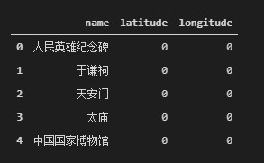
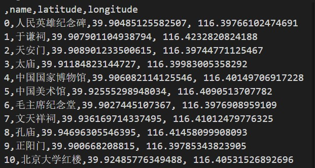
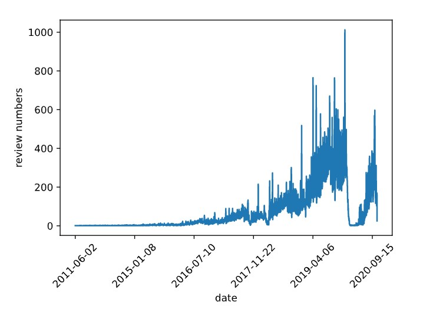
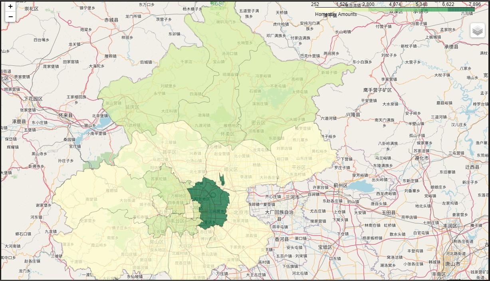
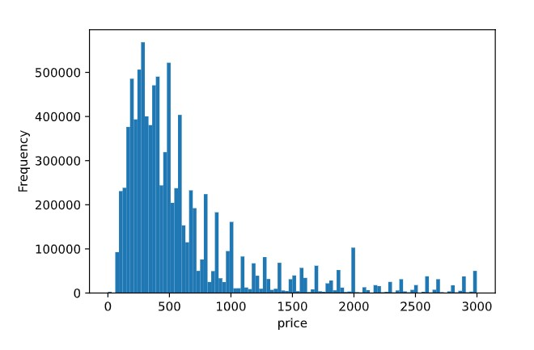
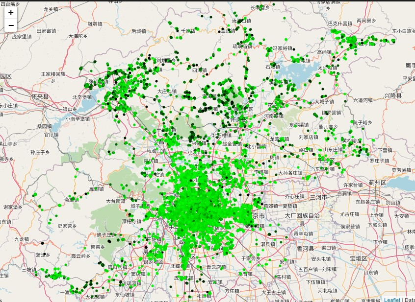
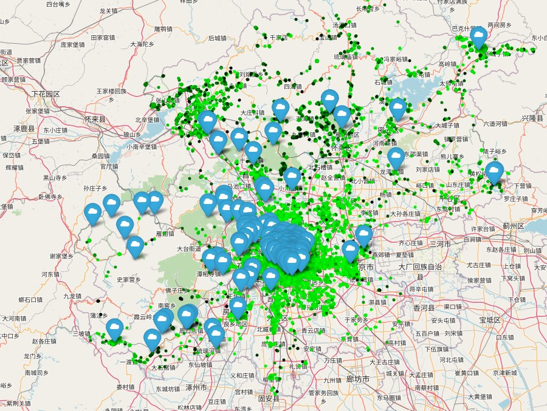
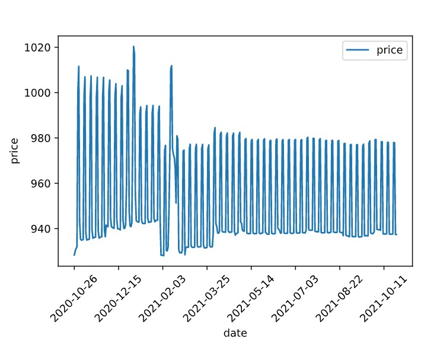
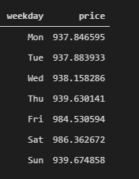

# Capstone Project: Airbnb open data analysis: homestay in Beijing

## **1. Introduction/Business Understanding**
In the past 4 years, "shearing economy" is the hottest word in China, this type of business mode encourage people to rent a commodity instead of bying one, at the same time, people can also rent their items to others to get remuneration.

Homestay is a type of "sharing economy", many people have at least one extra bedroom or even an extra house, homestay is a way to rent them to others. In old days, the only way for house owners to rent their house out is renting them to young man who working in city but cannot afford to buy a house, now they can open a homestay to provide living service for travaler arround the world.

For customers, as an instead choice of hotel, the advantage of homestay is the house owner do not need to serve many customers at the same time, so they can get higher qulity service. on the other hand, the price of homestay usually cheaper than hotel.

Airbnb is a famous homestay infomation publish platform, I will use the data of it to get a insight of this business in Beijing.If you want to traval to Beijing some days or you want to start your home stay business in Beijing, this project may help you.

## **2. Data Requirements**
To finish this project, we need following data:
**Summary information and metrics for listings in Beijing of Airbnb.**

Datasource: http://data.insideairbnb.com/china/beijing/beijing/2020-10-26/visualisations/listings.csv

Description: It contains the geo-infomation and roomtype of room advertised in Airbnb in Beijing. 

**Summary Review data and Listing ID.**

Datasource: http://data.insideairbnb.com/china/beijing/beijing/2020-10-26/visualisations/reviews.csv

Description: It contains review time and the review  target of review records in Airbnb in Beijing. 

**Detailed Calendar Data for listings in Beijing**

Datasource: http://data.insideairbnb.com/china/beijing/beijing/2020-10-26/data/calendar.csv.gz
Description: It contains the detailed information like price and review number of a room every day. 

**Beijing Travel Destinations List**
Datasource: https://zh.wikipedia.org/wiki/%E5%8C%97%E4%BA%AC%E6%97%85%E6%B8%B8%E6%99%AF%E7%82%B9%E5%88%97%E8%A1%A8
Description: Contains names of famous travel destinations of Beijing. 

## **3. Methodology**
### **3.1 Data Preparation**
#### **3.1.1 Scraping travel destinations list of Beijing and get their geocode information**
I first make use of [北京旅游景点列表
](https://zh.wikipedia.org/wiki/%E5%8C%97%E4%BA%AC%E6%97%85%E6%B8%B8%E6%99%AF%E7%82%B9%E5%88%97%E8%A1%A8) page from Wikipedia to scrap the table to create a data-frame. For this, I've used the requests-html library to get the page's html and then find out the "a" tags contains scenic spot, extract them and store into dataframe. We start as below:

As we can see above, we don't have geocode information yet. For foursqure API doesn't work well with Chinese, so I fill in the geocode data manually from google map. After a little work, we get a csv file below for this project.

### **3.2 Exploratory Data Analysis**

Firstly, I will use exploratory data analysis(EDA) to uncover hidden properties of data and provide useful insights to the reader, both future traveler and investor.

#### **3.2.1 Using review data**

Reviews data can be used as a representative of business conditions, I draw a line of the relationship between date and reviews number from 2011. We can easily read from the picture below that Airbnb spent its first 6 years of obscurity in Beijing, and achieved significant growth since 2017. But in 2020/01, its business took a devastating blow.Now we all know the main reason is the broke out of COVID-19 at Wuhan in 2020/01, it is a big desaster of Wuhan people, but it can have an effect on an American company's business in Beijing. So we must realize that we human beings are a whole, we should overcome difficulies toghter and pursue a better life.

#### **3.2.2 Using listing data**
We want to know how homestays distributed geographically first, I first calculate the number of homestays for every district in Beijing, and then plot a choropleth maps to visualize it.
we found that Chaoyang district has most homestays, it is mainlty because Cahoyang district that covers about one third of the core downtown of Beijing, and Chaoyang district is the most prosperous neighborhood in Beijing.

Price is a common concern for both house owners and tenants,I first extract the price data from the listing data, removed the outliners, then plot a hist graph to show its distribution.

In this graph, most price distributed in the range under 1000 RMB, and the peak center of price distribution is about 300--400 RMB. 

Detailly, I plot every homestay in the listing data on the map and filled with different colors, the darker color means higher price. In the graph below, we can see that the density of homestays distribution is high in core area(inside Beijing's 5th Ring Road), but the most expensive houses are mainly located in the suburbs.

#### **3.2.3 Using travel destination data**
In the map of homestays distribution, I notice that homestays in suburbs gathered to some small clusters, I guess it is because there are some travel destinations around.So I read in the travel destination list and marked them as blue clund icon on the map, then I got the map below:

So the hypothesis I made is obviously true, a step forward, we can say most homestay customers get there for a trip instead of other puepose such as business meeting.
#### **3.2.4 Using calender data**
The canlendar data contains the house booking price in the future one yuear, I plot a line to represent the relationship of date and price. we can see that the booking price changing weekly, and in a general scene, a further the book time from now can get a lower price.

Then I grouped the calendar data by weekdays and calculate the mean price by weekday, as the table below, Friday and Saturday are the most expensive two days in a week.

## **4. Results**

We did a simple analysis of the data of Airbnb in Beijing, and wo found some insights which might be useful to travelers or people who has business interests in homestays, let's summarize our findings:

- Chaoyang distric has most homestays among the all 16 districs in Beijing.
- Most homestays located inside the Beijing's 5th Ring Road, the homestay density of downtown is higher than suburbs, but the homestay price of suburbs usually higher.
- Airbnb is experencing a explosive growth in Beijing until the broke out of COVID-19, we can beleive that it will continue its grouth trends after the epidemic.
- Most homestays cost between 100 and 1000 per night,  the most intensive price range is 300 - 500.
- Homestay in suburbs usually garthering around some travel destinations.
- Booking room in 3 months, a later check in date costs lower; but booking rooms in months later, they always in a low price range and do not change with check in day.
- House price changing weekly, Friday and Saturday are most expensive.

## **5. Discussion**
In my analysis, only covered the geographical and price feature of homestays. Limited by my personal ability, I ignored many information inside the data source, such as the opreating conditions of house owners, if you want to start your homestay  business in Beijing, you need more research on finding the factors have effect on the price. 

## **6. Conclusion**

In nowadays, data is produced in an extremely fast speed, but we haven't manage it and use it in an effective way. 
In this project, I used the knowledge learning from the IBM Data Science courses, explored the current situation of the homestay industry, and found something useful for travelers to Beijing and people who interested in homestay business, they can make a better decision base on the information privided by this report. Data science is a powerful tools for modern business and life, and it can help us to know the world better.

## 7. References

[1]. https://medium.com/@radialee/capstone-project-the-battle-of-neighborhoods-in-tokyo-restaurants-45a503e65ff

[2]. http://insideairbnb.com/get-the-data.html